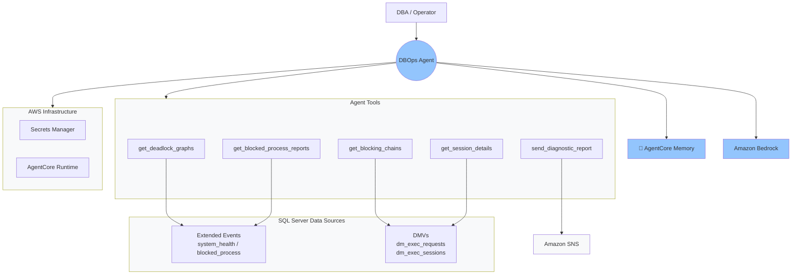

# Autonomous DBOps: Agentic AI for Maintaining Databases

  

An AI-powered SQL Server database operations agent built with [Strands Agents](https://github.com/strands-agents/sdk-python) and deployed on [Amazon Bedrock AgentCore Runtime](https://docs.aws.amazon.com/bedrock-agentcore/latest/devguide/). The agent investigates deadlocks and blocking on Amazon RDS for SQL Server, performs root cause analysis, and sends diagnostic reports via Amazon SNS.

## How it works

| Step | Description |
|------|-------------|
| 1️⃣ Invoke | Operator calls the agent via `agentcore invoke` with a prompt |
| 2️⃣ Analyze | Agent reasons about symptoms and selects the right diagnostic tools |
| 3️⃣ Execute | Agent runs `@tool` functions against SQL Server DMVs and Extended Events |
| 4️⃣ Reason | Claude analyzes deadlock graphs, blocking chains, and session details |
| 5️⃣ Report | Agent sends findings and recommendations to the DBA team via SNS |
| 6️⃣ Remember | AgentCore Memory saves facts and session summaries for future recall |

## Architecture



## What the agent does

| Tool | Purpose | Data source |
|------|---------|-------------|
| `get_deadlock_graphs` | Reads deadlock graphs with full details for both sides | `system_health` XE session (`xml_deadlock_report`) |
| `get_blocking_chains` | Walks the current blocking hierarchy, identifies head blockers and their SQL | DMVs (`sys.dm_exec_requests`, `sys.dm_exec_sql_text`) |
| `get_session_details` | Retrieves login, host, program, and SQL for a specific session | DMV (`sys.dm_exec_sessions`) |
| `get_blocked_process_reports` | Reads historical blocking details including both blocker and blocked sessions | Custom XE session (`blocked_process_report`) |
| `send_diagnostic_report` | Sends the agent's findings and recommendations to the DBA team | Amazon SNS |

## Prerequisites

### Amazon RDS for SQL Server

- An RDS for SQL Server instance (Standard or Enterprise Edition)
- Trace flags 1204 and 1222 enabled via a custom DB parameter group — see [Monitor deadlocks in Amazon RDS for SQL Server and set notifications using Amazon CloudWatch](https://aws.amazon.com/blogs/database/monitor-deadlocks-in-amazon-rds-for-sql-server-and-set-notifications-using-amazon-cloudwatch/) for setup steps
- *(Optional)* Custom XE session for `blocked_process_report` for historical blocking — see [Using extended events with Amazon RDS for Microsoft SQL Server](https://docs.aws.amazon.com/AmazonRDS/latest/UserGuide/SQLServer.ExtendedEvents.html)
- Database credentials stored in **AWS Secrets Manager** (`host`, `username`, `password`, `port`) → `DB_SECRET_ID`
- An **Amazon SNS** topic with an active subscription → `SNS_TOPIC_NAME`

### Amazon Bedrock AgentCore

- **Amazon Bedrock** foundation model access enabled in your region → `AWS_REGION`
- An **IAM execution role** with permissions for Bedrock, Secrets Manager, SNS, and CloudWatch Logs ([permissions guide](https://docs.aws.amazon.com/bedrock-agentcore/latest/devguide/runtime-permissions.html)) → `AGENTCORE_ROLE_ARN`

  Create the role using the included least-privilege policies. The policy template uses your environment variables from step 2:

  ```bash
  export AWS_ACCOUNT_ID=$(aws sts get-caller-identity --query Account --output text)

  envsubst < agentcore-execution-role-policy.json > /tmp/policy.json

  aws iam create-role \
    --role-name AgentCoreDBOpsRole \
    --assume-role-policy-document file://agentcore-execution-role-trust-policy.json

  aws iam put-role-policy \
    --role-name AgentCoreDBOpsRole \
    --policy-name AgentCoreDBOpsPolicy \
    --policy-document file:///tmp/policy.json

  export AGENTCORE_ROLE_ARN=$(aws iam get-role --role-name AgentCoreDBOpsRole --query 'Role.Arn' --output text)
  ```
- A **VPC** with private subnets and a security group allowing outbound traffic to RDS on port 1433 → `SUBNET1`, `SUBNET2`, `SECURITY_GROUP_ID`

### Development environment

- **Python** 3.10+ (macOS, Linux, or Windows)
- **AWS CLI** configured with appropriate permissions

## Quick start

### 1. Clone and install

```bash
git clone https://github.com/aws-samples/sample-agentcore-sqlserver-dbops-agent.git
cd sample-agentcore-sqlserver-dbops-agent

python3 -m venv .venv
source .venv/bin/activate

pip install -r requirements.txt
pip install bedrock-agentcore-starter-toolkit
pip install 'urllib3<2' 'chardet<6'
agentcore --help
```

### 2. Set environment variables

```bash
export AWS_REGION=<your-region>
export DB_SECRET_ID=<your-secrets-manager-secret-id>
export SNS_TOPIC_NAME=<your-sns-topic-name>
export AGENTCORE_ROLE_ARN=<your-execution-role-arn>
export SECURITY_GROUP_ID=<your-security-group-id>
export SUBNET1=<your-first-private-subnet-id>
export SUBNET2=<your-second-private-subnet-id>
```

### 3. Configure for AgentCore deployment

```bash
agentcore configure \
  --name sqlserver-dbops-agent \
  --entrypoint agent.py \
  --execution-role $AGENTCORE_ROLE_ARN \
  --deployment-type direct_code_deploy \
  --vpc \
  --subnets $SUBNET1,$SUBNET2 \
  --security-groups $SECURITY_GROUP_ID
```

### 4. Deploy

```bash
agentcore deploy \
  --env AWS_REGION=$AWS_REGION \
  --env DB_SECRET_ID=$DB_SECRET_ID \
  --env SNS_TOPIC_NAME=$SNS_TOPIC_NAME \
  --env AGENT_OBSERVABILITY_ENABLED=true
```

### 5. Verify and invoke

```bash
agentcore status

agentcore invoke '{"prompt": "Check for deadlocks in the last 24 hours, provide RCA and recommendations, and send a diagnostic report via SNS"}'
```

## Adding memory (optional)

AgentCore Memory lets the agent retain findings across sessions using two strategies:

- **Semantic memory** (`dbops_facts`) — stores and retrieves factual findings (e.g., "Table X had 12 deadlocks last week") using vector similarity search
- **Summary memory** (`dbops_summaries`) — stores conversation summaries per session so the agent can recall what was discussed previously

The agent dynamically fetches strategy IDs at startup via `MemoryClient.get_memory_strategies()` and configures retrieval thresholds (`top_k`, `relevance_score`) for each. Memory is scoped per session and actor, and the session manager runs as a context manager to ensure events are flushed.

```bash
# Create memory resource with both strategies
agentcore memory create dbops_shared_memory \
  --strategies '[{"semanticMemoryStrategy": {"name": "dbops_facts"}}, {"summaryMemoryStrategy": {"name": "dbops_summaries"}}]' \
  --event-expiry-days 30 \
  --region $AWS_REGION \
  --wait

# Set the memory ID and redeploy
export AGENTCORE_MEMORY_ID=<memory-id-from-above>

agentcore configure \
  --name sqlserver-dbops-agent \
  --entrypoint agent_with_memory.py \
  --execution-role $AGENTCORE_ROLE_ARN \
  --deployment-type direct_code_deploy \
  --vpc \
  --subnets $SUBNET1,$SUBNET2 \
  --security-groups $SECURITY_GROUP_ID

agentcore deploy \
  --env AWS_REGION=$AWS_REGION \
  --env DB_SECRET_ID=$DB_SECRET_ID \
  --env SNS_TOPIC_NAME=$SNS_TOPIC_NAME \
  --env AGENTCORE_MEMORY_ID=$AGENTCORE_MEMORY_ID \
  --env AGENT_OBSERVABILITY_ENABLED=true
```

If `AGENTCORE_MEMORY_ID` is not set, the agent falls back to stateless mode (same behavior as `agent.py`).

## Testing with a simulated deadlock

Create two tables and run two concurrent transactions that update them in opposite order to trigger a deadlock:

```sql
-- Session 1
CREATE TABLE ##Employees (ID INT PRIMARY KEY, Name VARCHAR(50));
CREATE TABLE ##Suppliers (ID INT PRIMARY KEY, Name VARCHAR(50));
INSERT INTO ##Employees VALUES (1, 'Alice');
INSERT INTO ##Suppliers VALUES (1, 'Acme');

BEGIN TRAN;
UPDATE ##Employees SET Name = 'Bob' WHERE ID = 1;
WAITFOR DELAY '00:00:05';
UPDATE ##Suppliers SET Name = 'Beta' WHERE ID = 1;
COMMIT;
```

```sql
-- Session 2 (run concurrently)
BEGIN TRAN;
UPDATE ##Suppliers SET Name = 'Gamma' WHERE ID = 1;
WAITFOR DELAY '00:00:05';
UPDATE ##Employees SET Name = 'Charlie' WHERE ID = 1;
COMMIT;
```

Then invoke the agent to analyze:

```bash
agentcore invoke '{"prompt": "Check for deadlocks in the last hour and provide root cause analysis"}'
```

## Observability

Deploy with `AGENT_OBSERVABILITY_ENABLED=true` and include `aws-opentelemetry-distro` in requirements (already included). AgentCore automatically instruments traces, token usage, and request duration. View metrics in the **CloudWatch GenAI Observability** dashboard.

## Project structure

```
├── agent.py                              # Main agent with all tools
├── agent_with_memory.py                  # Agent with AgentCore Memory integration
├── requirements.txt                      # Python dependencies
├── agentcore-execution-role-policy.json  # Least-privilege IAM policy
├── agentcore-execution-role-trust-policy.json  # Trust policy for AgentCore
├── LICENSE                               # MIT-0 License
├── NOTICE                                # Copyright notice
├── THIRD-PARTY-LICENSES                  # Third-party dependency licenses
└── README.md
```

## Security

- Database credentials are retrieved from AWS Secrets Manager at runtime — never hardcoded
- All SQL queries use parameterized queries (`%s` placeholders) to prevent SQL injection
- The agent runs in your VPC with private subnets
- Use a dedicated, least-privilege database login for the agent

See [CONTRIBUTING](CONTRIBUTING.md#security-issue-notifications) for more information.

## License

This project is licensed under the [MIT-0 License](LICENSE).

See [LICENSE](LICENSE) for more information.
